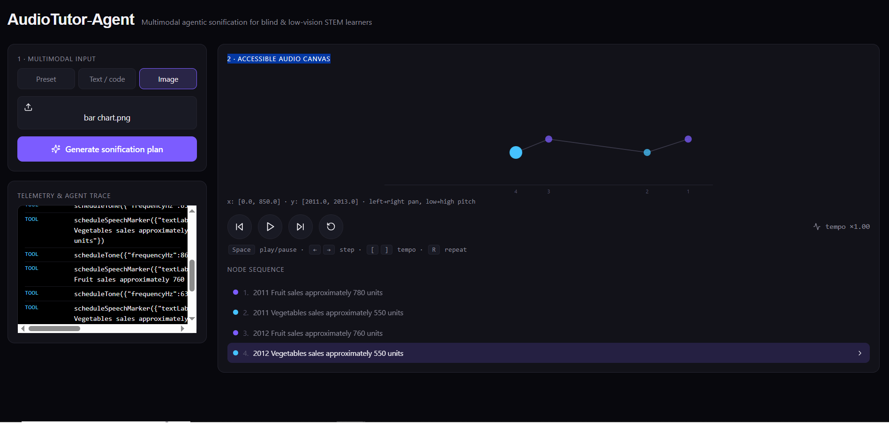
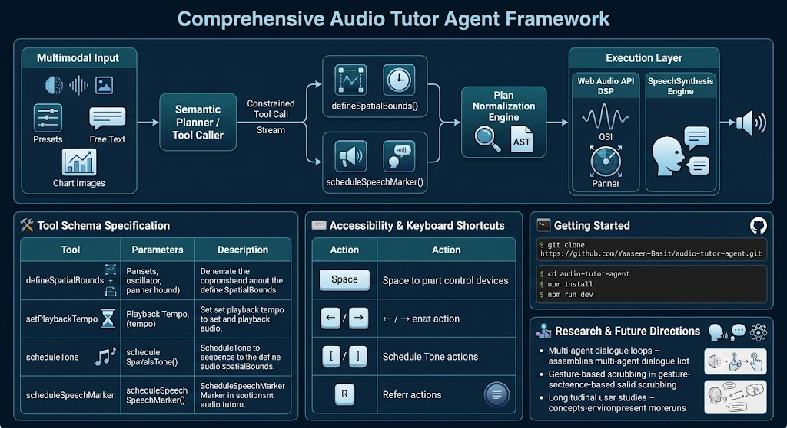

# AudioTutor-Agent: Multimodal Agentic Sonification for STEM Accessibility
**Author:** Yaaseen Basit

> An interactive research prototype exploring how agentic tool-calling, multimodal AI, real-time Web Audio synthesis, and accessible interaction design can translate visual and algorithmic STEM representations into spatialized audio experiences for blind and low-vision learners.

---

##  Prototype
<p align="center">
  
</p>

<p align="center">
  
</p>

*AudioTutor-Agent: multimodal STEM input, agentic planning, constrained tool execution, and spatialized sonification.*

---

## 🎯 Research Motivation & Vision

Standard STEM educational materials rely heavily on visual representations:

- Algorithm traces and execution states
- Sorting operations and pointer swaps
- 2D charts and data distributions
- Mathematical functions
- Trees and graphs
- Spatial relationships between data elements

Conventional screen-reader workflows primarily linearize these representations into text, which can make structural relationships, spatial positioning, and progression difficult to perceive.

**AudioTutor-Agent** explores an alternative interaction model in which multimodal STEM representations are transformed into structured auditory experiences.

The core interaction loop is:

```text
Visual / Text STEM Input
          ↓
Agentic Semantic Planner
          ↓
Constrained Tool Calls
          ↓
Plan Normalization & Validation
          ↓
Deterministic Browser Execution
          ↓
Spatial Web Audio + Speech Cues
The prototype investigates how an AI agent can reason about a STEM representation while delegating actual audio execution to a constrained browser-side tool layer.

🔬 Research Question

Can multimodal agentic AI transform visually structured STEM representations into interactive auditory representations while preserving semantic relationships, progression, and spatial context?

The prototype focuses on the intersection of:

Human-AI interaction
Multimodal foundation models
Agentic AI
Sonification
Web Audio
Accessibility
Assistive technology
STEM education
⚡ Core Features
Agentic Semantic Planning

The prototype uses a multimodal foundation model to analyze STEM inputs such as:

Source code
Numerical arrays
Chart images
Structured algorithmic representations

The model produces a structured sonification plan rather than directly controlling browser APIs.

This introduces an intermediate semantic layer between AI reasoning and interaction execution.

🔧 Constrained Tool Calling

The agent communicates with the browser execution layer through a predefined tool interface.

Available tools include:

defineSpatialBounds()
setPlaybackTempo()
scheduleTone()
scheduleSpeechMarker()

The constrained interface allows the agent to express what should happen, while deterministic browser-side code controls how it is executed.

🔊 Real-Time Web Audio DSP

Audio is synthesized in real time using the browser's native Web Audio API.

Core browser audio components include:

AudioContext
OscillatorNode
StereoPannerNode
BiquadFilterNode
GainNode
Gain envelopes / ADSR-style amplitude control

The prototype does not depend on pre-recorded audio samples for its sonification layer.

🎼 Harmonic Quantization

Numerical values can be mapped to an A-minor pentatonic scale over an approximately 220 Hz–1760 Hz range.

The quantization strategy is intended to reduce dissonance during continuous playback while preserving relative differences between values.

🎚️ Multi-Parameter Acoustic Mapping

AudioTutor-Agent maps multiple properties of a STEM representation to acoustic parameters.

Acoustic Parameter	Semantic Mapping
Pitch (Hz)	Magnitude / numerical value
Stereo Pan (-1.0 to +1.0)	Horizontal position / sequence progression
Timbre	Semantic node or event role
Speech Cue	Human-readable semantic description
Timbre Mapping
Waveform	Example Semantic Role
sine	Base / normal
triangle	Branch / child
sawtooth	Anomaly / swap
square	Pivot / comparison

This allows multiple dimensions of a representation to be communicated simultaneously through sound.

♿ Accessibility & Non-Visual Interaction

The prototype is designed to reduce dependence on visual interaction.

Accessibility features include:

Keyboard-based navigation
Play / pause controls
Sequential node navigation
Replay controls
Playback speed adjustment
aria-live announcements
Spoken semantic descriptors
Auditory feedback
Keyboard Controls
Key	Action
Space	Play / Pause continuous playback
←	Previous node
→	Next node
[	Decrease playback tempo
]	Increase playback tempo
R	Replay current node audio and speech cue
🏗️ System Architecture

The architecture separates probabilistic AI reasoning from deterministic interaction execution.

High-Level Architecture
┌─────────────────────────────────────────────────┐
│                MULTIMODAL INPUT                 │
│                                                 │
│   Text / Code / Numerical Data / Chart Image    │
└────────────────────────┬────────────────────────┘
                         │
                         ▼
┌─────────────────────────────────────────────────┐
│          AGENTIC SEMANTIC PLANNER               │
│                                                 │
│       Multimodal Foundation Model               │
│       Semantic Interpretation                   │
│       Sonification Planning                     │
└────────────────────────┬────────────────────────┘
                         │
                         ▼
┌─────────────────────────────────────────────────┐
│           CONSTRAINED TOOL-CALL LAYER           │
│                                                 │
│ defineSpatialBounds()                           │
│ setPlaybackTempo()                              │
│ scheduleTone()                                  │
│ scheduleSpeechMarker()                          │
└────────────────────────┬────────────────────────┘
                         │
                         ▼
┌─────────────────────────────────────────────────┐
│          PLAN NORMALIZATION ENGINE              │
│                                                 │
│ Schema Validation                               │
│ Output Normalization                            │
│ AST / Text Recovery                             │
│ Fault Recovery                                  │
└────────────────────────┬────────────────────────┘
                         │
                         ▼
┌─────────────────────────────────────────────────┐
│            DETERMINISTIC EXECUTION              │
│                                                 │
│      Browser-Side Interaction Controller        │
└────────────────────────┬────────────────────────┘
                         │
              ┌──────────┴──────────┐
              │                     │
              ▼                     ▼
┌────────────────────────┐  ┌─────────────────────┐
│     WEB AUDIO API      │  │  SPEECH SYNTHESIS   │
│                        │  │                     │
│ OscillatorNode         │  │ Spoken descriptors  │
│ StereoPannerNode       │  │ ARIA-live cues      │
│ BiquadFilterNode       │  │                     │
│ Gain / Envelopes       │  │                     │
└────────────────────────┘  └─────────────────────┘
🛠️ Tool Schema

The agent communicates with the browser frontend through structured tool invocations.

Tool	Parameters	Description
defineSpatialBounds	xMin, xMax, yMin, yMax	Defines the virtual spatial mapping bounds
setPlaybackTempo	bpmMultiplier	Controls relative playback speed
scheduleTone	frequencyHz, stereoPan, durationSec, timbreType	Schedules a synthesized audio event
scheduleSpeechMarker	textLabel, delayOffsetSec	Schedules a synchronized spoken descriptor
Example Tool Execution
Agent
  │
  ├── defineSpatialBounds(...)
  │
  ├── setPlaybackTempo(...)
  │
  ├── scheduleTone(...)
  │
  └── scheduleSpeechMarker(...)
          │
          ▼
   Browser Execution Layer
          │
          ├── Web Audio DSP
          │
          └── Speech Synthesis

This architecture deliberately limits the agent's direct control over browser APIs.

🛡️ Fault-Tolerant Execution

Foundation-model outputs can occasionally deviate from an expected structured format.

AudioTutor-Agent therefore includes a normalization and recovery layer designed to handle malformed or partially structured outputs.

The prototype includes:

Tool-call schema validation
Output normalization
Regex-based recovery for malformed structured responses
Deterministic fallback planning
Offline execution paths for network-resilient experimentation

The objective is to prevent a malformed model response from directly breaking the interactive audio execution pipeline.

🧠 AI → Tool → Browser Execution

A central design principle of AudioTutor-Agent is the separation between AI reasoning and browser execution.

             AI / Probabilistic Layer
                     │
                     ▼
           Semantic Interpretation
                     │
                     ▼
             Sonification Plan
                     │
                     ▼
             Structured Tools
                     │
          ┌──────────┴──────────┐
          ▼                     ▼
      Audio Events         Speech Events
          │                     │
          └──────────┬──────────┘
                     ▼
            Deterministic Browser
                 Execution

This architecture makes the interaction layer more predictable and easier to test independently from the foundation model.
---

## 👤 Author

**Yaaseen Basit**

Research-oriented software engineer and educator interested in:

**AI × Human-AI Interaction × Education × Accessibility × Web Technologies**
